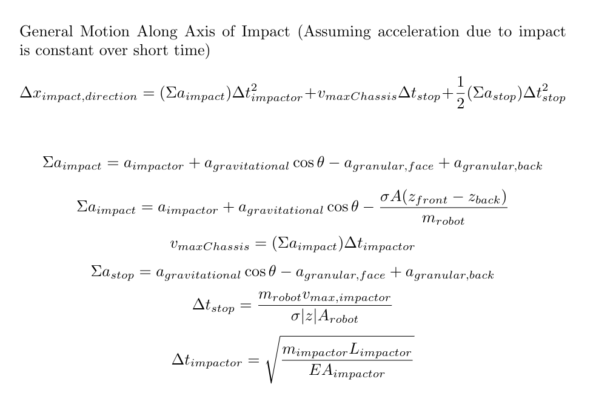
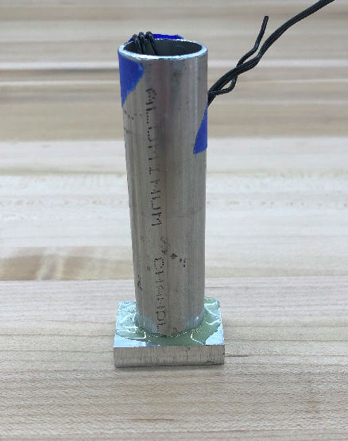
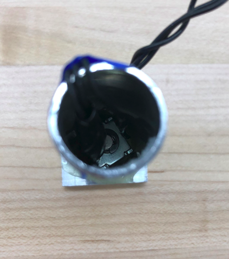
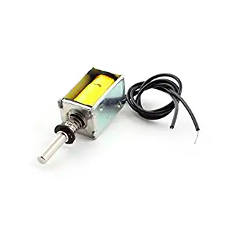
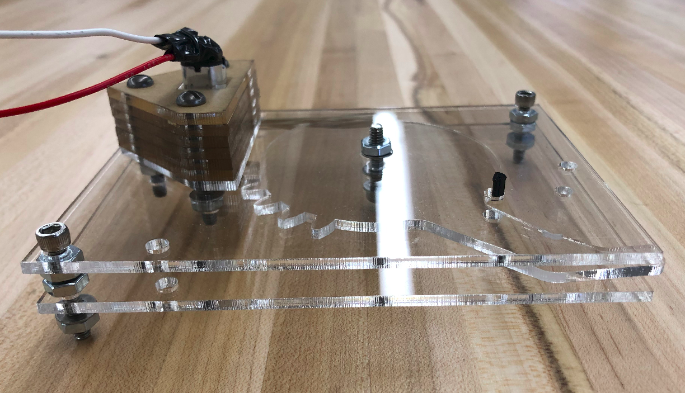
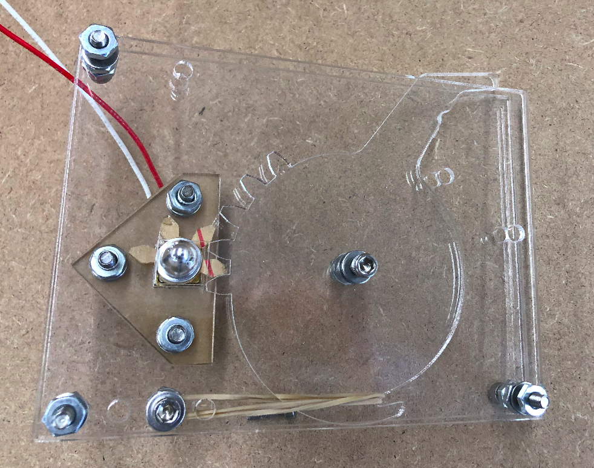
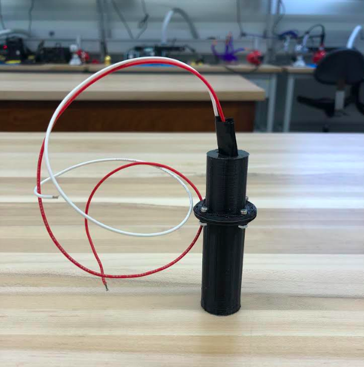
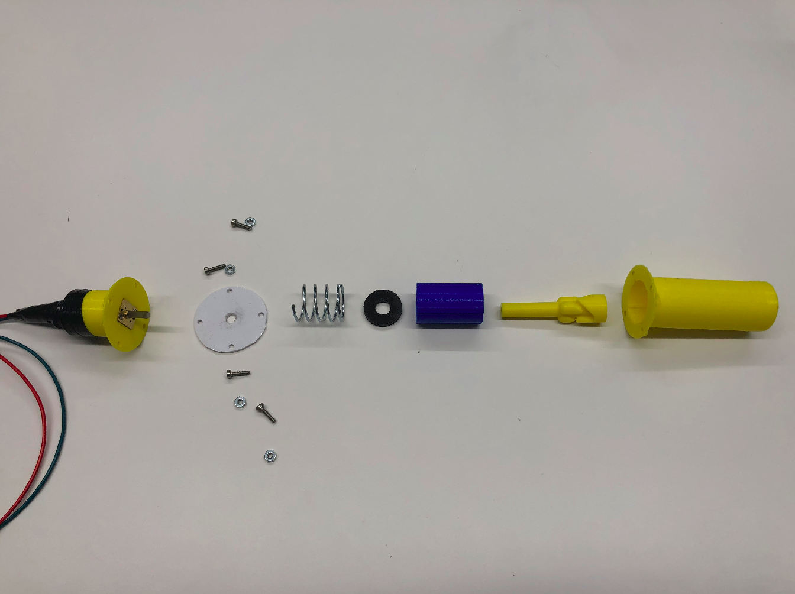
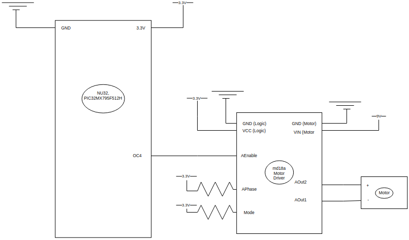
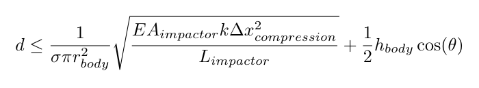

### Introduction

Granular media are everywhere in the world around us ranging from the sand on beaches to grains in silos and even to the soil we walk on when strolling through a park. Acheiving motion in and on granular media allows us to study the behavior of the media itself and how materials interact with the media in various states and to reach desired trajectories within the media (such as the shortest path to a deposit of material or information). Some animals and plants have evolved to locomote through sand and soil, growing roots or displacing material in order to reach water, build caverns, and generally travel. Current popular methods of interacting with granualar media to reach goals include drilling and scoop-based displacement digging or external actuator-based fluidization followed by quick motions. These methods have open-mechanical components interacting with the granular media itself. Locomoting through and in a granular media without leaving mechanisms open to the elements remains an interesting and less-explored technique which can have lifespan benefits due to amounts of wear and which can potentially lead to simpler interactions with the granular material itself.  

### Current and Recent Research 

A natural divide for looking at locomotion regarding granular materials is to consider motion on the surface and motion below the surface.  

#### Surface Motion

In a collaboration between researchers at Carnegie Mellon (Dr. Howie Choset) and Georgia Tech (Dr. Daniel Goldman), a sidewinding snake robot was developed to utilize an animal study in which varying surface contact area in sidewinding snakes enables them to ascend granular slopes.  
Dan Goldman and Dr. Paul Umbanhowar collaborated to produce a robot with flippers taking inspired by the biomechanics of young sea turtles crossing sand to reach the ocean after hatching. A flexible wrist is key in acheiving efficient motion here.  
NASA JPL's hopping hedgehog robot utilizes internal flywheels to jump, roll, and tumble on uneven terrain.  

#### Subsurface Motion
Dr. Chen Li et al Studied terradynamics of legged locomotion in and on various granular media, yielding valuable information regarding stresses on objects during penetration and extraction in granular media.  
Goldman's lab in collaboration with Umbanhowar also developed an undulating robot inspired by the oscillitory motion of a sandfish lizard. Studying the types of movement, the group found patterns which optimize speed and energy use.
Dr. Anette Hosoi and her former student Amos Winter developed a digging robot based on razor clam locomotion that utilizes fluidization of the surrounding granular media during and following specific quick movements.  
Stephanie Chang, an MS in Robotics alumnus from Northwestern previously worked with Paul Umbanhowar to develop an auger-based robot for locomotion in granular media.  
Dr. Tilman Spohn and a team of researchers developed and built the HP3 sensor for the InSight rovor to study temperature fluctuations in the Martian regolith. The device is described as a self-hammering nail and uses an internal impact-based locomotion mechanism with a conical tip on a cylindrical body.  

### Overview

The goal of this project is to design, build, and test a robot capable of using impulse-based locomotion on and in granular media for three dimensional motion. This impulse-based locomotion is similar in concept to a piledriver and utilizes research on the yield stress of granular materials. Whereas other recent research into digging and locomotion in granular material has focused more on external methods of moving the media in such a way that it is either fluidized or displaced, this project aims to use no external moving parts and rely purely on the impulsed energy from an internal actuator along with buoyant effects in the media.

### Feasibility

There are two important parts of the impact and resultant motion to consider, and let us assume that all energy is transferred in one impact (such that there are not successive energetically decreasing elastic impacts in each larger impact). One part is the part during which the impactor is still moving toward the chassis and approximate elastic deformation is occurring. The chassis reaches a maximum velocity due to the impact and then the second stage takes over. During the second stage, the motion of the entire chassis is governed by the initial maximum velocity and the pressure applied by the granular material.
From the work done by Chen Li et al in which yield stresses of granular materials were characterized, they found that the yield stress &sigma; linearly increases with depth. Treating the materials in impact as a spring and mass, we can find an acceleration and in turn an impact time.  
Using this time along with the accelerations on the inside and outside of the chassis of the system, we can calculate the expected change in position. Performing some test calculations with common and likely materials showed expected changes in position within an order of magnitude of the grain size of common granular materials such as medium-grain sand and poppy seeds. Based on these sample calculations, building out prototypes to test the understanding of the impacts and accelerations the chassis will undergo is beneficial to a design of the whole robot.

  
The technical documents with relevant derivations and theory are available for viewing on Overleaf at this [link](https://www.overleaf.com/read/srybycnmcjgs).

### Impact Mechanism Explorations

#### Solenoid-based

Given that the desired effect is one surface repeatedly linearly impacting another surface which is the chassis of the robot in the direction of travel, one clear option is a solenoid-based impact mechanism. Current in a coil then accelerates a plunger along the access of its magnetic field inside the coil until the plunger impacts or reaches its stroke length. This can be repeatedly actuated in such a way. The resultant motion is a function of current since that is the driving factor in the magnetic field that accelerates the plunger before it impacts the surface. The limitations here are the current and voltage limits in the circuit which depend on the specific solenoid actuator and other components in the circuit.

Pros:
* Linear actuation
* Frictionless plunger movement unless off axis forces applied to shaft
* Force modulated by current  
  
Cons:
* Limited to pre-existing plunger impact surface without special modifications
* Low mass impactor while momentum of the impactor is a key factor in theoretical distance traveled

#### Gear and Motor Planar System

Another option is utilizing a gearing system with a custom tooth set to store potential energy in a spring and use the release to impact a surface with either a custom tooth or an attachment to the gear at the end of the motor-gear system. The system here is limited by its shape since gearing up from the motor to a gear-based impactor has impact forces increasing with the radii of the gear at the end of the connected system. Despite its limitations, it shows that the forces desired in the system can be acheived using the combination of a small motor and physical gear-based impactors.

Pros:
* Rapid prototype iteration
* Impactor path is not a straight curve, which results in more lateral forces  
  
Cons:
* More than 1-D motion requires intersecting planar mechanisms

#### Cylindrical Rotational-to-Linear System

Building on the previous prototypes and ideas, the third prototype uses a motor to transform rotational motion into linear motion to store energy in a spring. Then, the release can be utilized to impact a surface with a component along the spring's axis of compression.

Pros:
* Motor naturally co-axial with impactor
* High impactor surface area to outside chassis surface area ratio  
  
Cons:
* Still need intersecting linear mechanisms for more than 1-D motion

### Chosen Design

Given the benefits of having a motor co-axial with the impactor and those of having a low volume to output force ratio with the rotational-to-linear cylindrical impactor system, this became the chosen testbed for further exploration. In this prototype, for the purpose of allowing the greatest variance in angles and spring compression, I have chosen to limit the number of helix rises to three. Fewer rises can acheive the same spring compression with lower angles. So lower friction forces resist the motor as it compresses the spring.

#### Components

* Motor Casing
* Chassis With Slots
* Slider Mechanism
* Motor Spacer
* Helix Rotator
* Spring Spacer
* Spring
* Motor
* NU32 PCB
* 1 or more Breadboards
* Motor Driver
* Resistors ( 10k&Omega;)
* Capacitors ( 10&mu;F)
* Power Supply (6-12V, I&ge;1.2mA)
* Bolts
* Nuts
* Washers

#### Electronics

##### Circuit Diagram

### Experiments and Characterization

For the following experiments, a container filled with poppy seeds is used for horizontal and vertical locomotion experiments with and without additional mass added to the impactor. The results are visible below, and the film is sped up to be visible in quick succession.

#### Motion Experiments

##### Horizontal Motion, No Additional Mass

##### Vertical Motion (Up), No Additional Mass

##### Horizontal Motion, Additional Mass

##### Vertical Motion (Up), Additional Mass

### Discussion

#### Performance

Make a chart here: ?  
  
Minimum force to move up in less than 5cm for given geometry: 3.7 N  
Minimum energy used per up buried less than 5cm cm traveled: 0.037 J&frasl;cm  
Minimum force to move horizontal for given geometry (unburied): 0.25 N  
Minimum energy used per horizontal unburied at surface cm traveled: 0.0025 J&frasl;cm  
Minimum force to move horizontal for given geometry (buried): 1.47 N  
Minimum energy used per horizontal buried at surface cm traveled: 0.0147 J&frasl;cm  
Average motor current: 65 mA  
Average motor voltage: 9.48 V  
Energy used per horizontal buried at surface cm traveled: 24 J&frasl;cm  
Up (mass): 2 cm / min  
Energy used per cm vertical up buried less than 5cm for given geometry: 18.3 J&frasl;cm  

The energy expenditures per cm traveled are around 500 times the minimum energy required to move the object.

In order to compare efficiency, we can consider the amount of energy expended by a system in order to travel a certain distance. 
  
Efficiency compared to known systems/animals  

#### Limitations

##### Requirements for Motion:  

In order to move, the stress created by the impact force must be greater than the yield stress (&sigma;) on the surface of the robot in the direction of travel. For this simple calculation, let's assume that the other forces acting on the chassis are in equilibrium (such that the robot is of equal density to the granular material). Using the momenta in the system, we can manipulate the equations of motion in order to get an upper bound on depth as a function of the robot geometry, position, and materials.

Here, d represents depth below the surface of the granular material, E is the Young's modulus of the impactor, theta is the angle the body of the robot makes with the z-axis of the world frame, and k represents the spring constant of the spring used.  

The kinetic energy the impactor has depends on how much of the potential energy stored in the spring can be imparted onto the impactor. Since the spring imparts a force during decompression on both the impactor and the chassis in opposite directions, that means that the maximum energy is transferred to the impactor when the chassis is immobilized by forces that will keep it stationary during that decompression. The important part is to make sure that the impactor has enough momentum to allow the yield stress of the granular material in the direction of actuation to be exceeded.  

An additional limitation is that of the motor itself. The motor torque is limited by its construction, and the force exerted by the motor divided between the rises on the helical component must be greater than the combination of the friction and spring forces along the slope of the rise. So naturally higher slopes result in higher friction and spring force components which the motor must overcome to acheive spring compression.  

##### Material Limitations:

As can be seen in the above limitations on depth at which this robot can operate, the materials from which the impactor and chassis are made come into play as the Young's modulus. A higher value in this instance increases the range which the robot can travel in depth. An assumption made here is that the depth limitation is reached before the fracture limit of the chassis itself. 

In addition, as we can see from Chen Li's work with terradynamics in granular materials, the yield stresses' linear variance with depth means that objects embedded and/or moving within the material are subject to pressure differentials. This results in buoyant forces acting on the objects. So, using materials that overall result in a system less dense than the granular material, one should expect this buoyant force to assist in vertical motion. In other words, if the robot is not actuating, and the granular material is fluidized, the robot will eventually float to the surface.  

#### Behavior

When placed upright on the surface of the poppy seeds, the system agitates the material and rotates slightly, but the results are limited to this. The rotational forces being applied to the chassis include both those exerted by the wire for the motor as it prefers its coiled state along with those exerted by by the rotational elements inside the chassis. The lack of downward motion means that the combined forces from gravity along with the impact do not exceed the yield stress at the surface. In addition, there is an upward force on the chassis during the release as the spring applies force to both the chassis and impactor. This was confirmed using a force sensor. The upward force results in a small upward motion. Under the circumstance in which the spring force is not greater than the combination of forces applied on the chassis in the opposite direction as that of the spring on the chassis, the chassis will not see this reverse motion before the impact occurs. This is confirmed experimentally in submerged trials.  

One potential solution to the spring kickback force is increased friction or pressure on the reverse end of the robot chassis. This is most likely to occur while the robot is submerged. In order to acheive this without submersion (in order to allow digging from above-ground), one potential solution is utilization of a longer but weaker spring. The tradeoff is in size, shape, and complexity of a larger system that operates in more than 1-D motion. Using a longer and weaker spring to achieve the same overall impactor momentum would allow the acceleration of the impactor to occur over a longer period of time, applying lower forces to the chassis. This would allow movement when stabilization forces on the chassis (such as static friction and external pressure) are relatively low. This circumstance occurs especially when the chassis is partially or entirely above the surface of the granular material.  

Along the same line of thought as the long spring acceleration method, something interesting to explore is a method of slowing the spring-loading down to its minimum speed in order to reduce the magnitude of forces applied to the chassis during this process. This process allows the windup of the spring (which involves an acceleration of internal components of the system, thereby applying forces to the chassis as well) to be applied over a longer period of time. This means that the accelerations and therefore the forces applied to the chassis are smaller.  
  
The problem discussed above experimentally proved not to be an issue during upward motion, and the results are that the robot is able to locomote straight up through the material with relative ease. This can be explained by the pressure differential between robot ends and lower comparable density of the robot with respect to that of the granular material. Another factor at play could be relatively low friction in extraction compared to insertion in granular material which was seen by Chen Li et al in the explorations of terradynamics in granular media. The result is that a buoyant force assists in the motion and friction is not strong enough to prevent the motion.

The buoyant forces appear again in the horizontal motion experiments; when the robot operates at just below the surface, the pressure differential results in an upward motion in addition to motion along the actuation axis. In the experiments, increasing depth in horizontal motion experiments appears to increase the distance traveled over the same amount of time. This points again to stabilization forces such as friction and pressure on the back of the robot coming into play during the spring release.
  
It is important to consider that the actuation in this system is discrete. This is different from considering a continuous actuation system such as if you attach a motor to a wheel and rotation is directly related to motion. Continuous actuation in this system would create constant fluidization of the granular media directly surrounding the robot. This would leave the chassis susceptible to the buoyant forces constantly which would move the robot either up or down at a constant rate unless the system matches the density of the granular media. That could be a benefit depending on the particular use case or circumstance in which the robot is operating. Discrete actuation allows the granular media which has received kinetic energy from the robot system to reach a stationary equilibrium. This simplifies the system. If there were a constant buoyant force being applied and the system is too dense or not dense enough to maintain its position, then it would need to constantly counteract the buoyant force with actuation. Data from the force sensor showed that instead of the assumption made during the initial calculations that the impact is a single event, the impact event is actually successive energetically decreasing impact events. This behavior should be explored more in depth as it could result in longer fluidization times of the material surrounding the chassis. This could also be explored by choosing different materials.  

Another important point to discuss about the experiments is the mass variation of the impactor. I chose to make this change in order to examine the behavior expected given the reliance on momentum in the equations governing the resultant motion. An added benefit is that this increases the density of the robot and should allow for better digging compared to the original model. Although the added mass was not enough to make notable improvements in digging, it did result in improved horizontal and upward locomotion in and on the poppy seeds. This is potentially due to a combination of the impact itself and the increased friction with the material acting as a stabilizing force. However, more exploration of the behavior under different masses of impactor and robot density is necessary in order to fully understand the behavior of the system.

### Next Steps

* Sensorization
* 3-D actuation design (as opposed to current 1-D)
* Construction from metal
* Control based on sensor data and/or pre-calculated trajectories
* Variable speed
* Explore internal center of mass shifting and more uniform mass distribution for orientation
* Explore various impact per second speeds and examine behavior as fluidization time grows
* Explore with denser systems to examine behavior when buoyant forces are less of a deciding factor in the motion (heavier metal construction will aid with this, as will battery and control board mounting)  
* More experiments with different granular materials and packing

The ultimate vision of this project is a multidirectional version of this robot which aims to utilize several of the actuators used in the cylindrical robot simultaneously inside a sphere. This will allow for locomotion in any direction without reorientation.  
With regards to hardware, a mount for an IMU sensor and the PCB is under development, and an interesting expansion would be exploring control using that sensor data. An on-board battery supply system would allow the robot to be untethered. Battery supply has been tested for the motor itself, but power for the control board is still tethered at the moment. More robust development of the system using machined parts would also allow for more robust studying of the robot behavior in varying granular material conditions. Pursuing more experiments with denser materials will fill gaps in understanding regarding the effects of buoyance within the granular material.

## Acknowledgements

Many thanks to my adviser, Dr. Paul Umbanhowar (Northwestern U.), for his insightful discussions and support throughout this project. I also want to thank Dr. Matt Elwin and Bill Hunt (also at Northwestern) for their encouragement and advice along the way. This project would not have been possible without them and the support of the MS in Robotics program at Northwestern.

## References

* citation for terradynamics paper
* citation for actuator paper
* citation for sea turtle paper Paul
* citation for razor clam paper
* citation for nasa article
* citation for jpl hopping hedgehog
* citation for spring mass jumper goldman
* citation for sidewinder cmu ga tech
* citation friction granular material
* citation for granular impact in the critical state
* citation for foot design with fluidized granular beds
