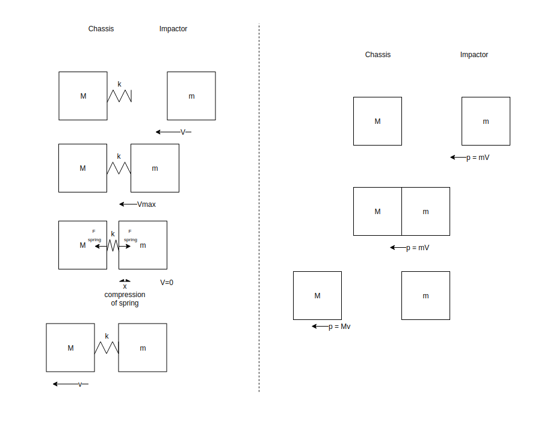
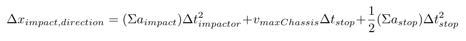
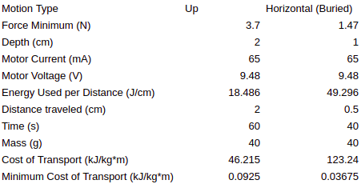

### Introduction

Granular media are everywhere in the world around us ranging from the sand on beaches to grains in silos and even to the soil we walk on when strolling through a park. Achieving motion in and on granular media allows us to study the behavior of the media itself and how materials interact with the media in various states and to reach desired trajectories within the media (such as the shortest path to a deposit of material or information). Some animals and plants have evolved to locomote through sand and soil, growing roots or displacing material in order to reach water, build tunnels or dens, and generally travel. Demonstrated methods of interacting with granular media to locomote include body shape undulation [3, 10, 15], auger-based locomotion [4], scoop-based displacement digging [10], or external actuator-based fluidization followed by quick motions [13]. With the exception of the body undulation technique, these methods have open-mechanical components interacting with the granular media. Locomoting through and in a granular media without leaving mechanisms open to the elements remains an interesting and less-explored technique which can have lifespan benefits due to amounts of wear and which can potentially lead to simpler interactions with the granular material.  

### Current and Recent Research 

A natural divide for looking at locomotion regarding granular materials is to consider motion on the surface and motion below the surface.  

#### Surface Motion

In a collaboration between researchers at Carnegie Mellon and Georgia Tech, Wright et al. developed a sidewinding snake robot [15] later utilized by Marvi et al. in an animal study in which varying surface contact area in sidewinding snakes enables them to ascend granular slopes [3].  
Mazouchova et al. produced a robot with flippers inspired by the biomechanics of young sea turtles crossing sand to reach the ocean after hatching. A flexible wrist is key in achieving efficient motion here [11].  
NASA JPL's hopping hedgehog robot utilizes internal flywheels to jump, roll, and tumble on uneven terrain [1].  

#### Subsurface Motion
Li et al. studied terradynamics of legged locomotion in and on various granular media, yielding valuable information regarding stresses on objects during penetration and extraction in granular media [8].  
Maladen et al. developed an undulating robot inspired by the oscillatory motion of a sandfish lizard. Studying the types of movement, the group found patterns which optimize speed and energy use [9].  
Winter et al. developed a digging robot based on razor clam locomotion that utilizes fluidization of the surrounding granular media during and following specific quick movements [14].  
Stephanie Chang and Paul Umbanhowar developed an auger-based robot for locomotion in granular media [4].  
Most closely related to my work is that of Spohn et al. who developed and built the HP3 sensor for the InSight rover to study temperature fluctuations in the Martian regolith. The device is described as a self-hammering nail and uses an internal impact-based locomotion mechanism with a conical tip on a cylindrical body [6].  

### Overview

The goal of this project is to design, build, and test a robot capable of using impulse-based locomotion on and in granular media for three dimensional motion. This impulse-based locomotion is similar in concept to a pile-driver and utilizes research on the yield stress of granular materials. Whereas other recent research into digging and locomotion in granular material has focused more on external methods of moving the media in such a way that it is either fluidized or displaced, this project aims to use no external moving parts and rely purely on the impulsed energy from an internal actuator along with buoyant effects in the media.  

In this article, I will detail the development and testing of a robot capable of using this mode of locomotion for one-dimensional movement. The ultimate vision of this project is a multi-directional version of this robot which aims to utilize several of the actuators used in the cylindrical robot simultaneously inside a spherical chassis. This will allow for locomotion in any direction without reorientation.

### Impulse-Based Locomotion

#### Background

At its simplest, the basic idea is that one can initially have two masses, and one is accelerated into the other, colliding inelastically and conserving momenta between the two masses in the collision. During the impact, all of the energy is converted from kinetic energy into potential energy, treating one of the materials as a spring using the Young's Modulus to represent stiffness of the material. This allows us to use a version of Hooke's Law for springs in the impact between the two masses of known material in order to model elastic deformation and the resulting forces.  
There are two important parts of the impact and resultant motion to consider, and let us assume for simplicity that all energy is transferred in one inelastic collision between the impactor and chassis. First is the impact phase during which the impactor is moving toward the chassis, and then approximate elastic deformation occurs as the impactor contacts the chassis. This is due to the stopping force the chassis applies to the impactor to stop its motion. The chassis reaches a maximum velocity due to the impact and resultant stopping force before the coasting stage takes over. During the coasting stage, the motion of the entire chassis is governed by the initial maximum velocity of the chassis and the pressure applied by the granular material.

#### Feasibility

From the work done by Li et al. in which yield stresses of granular materials were characterized, they found that the yield stress &sigma; linearly increases with depth in a granular material [8]. Treating the materials in impact as a spring and mass, we can find an acceleration and in turn an impact time.  
Using this time along with the accelerations on the inside and outside of the chassis of the system, we can calculate the expected change in position. Performing some test calculations with common and likely materials showed expected changes in position within an order of magnitude of the grain size of common granular materials such as medium-grain sand and poppy seeds. Based on these sample calculations, building out prototypes to test the understanding of the impacts and accelerations the chassis will undergo is beneficial to a design of the whole robot.

  
Relevent definitions, equations, derivations, and expressions for the variables used above can be found in the supplemental material [here](granularSupplementalMaterial.pdf).

### Impact Mechanism Explorations

The reason to explore mechanisms for impact is to aim for an optimization of potential impact forces, small size, and energy efficiency. In addition, since these prototype mechanisms are only for one-dimensional motion, I also want to consider how these mechanisms would extend for use in three-dimensional motion.
The ideal system would easily or naturally extend to three-dimensional motion, be small in size, symmetric about one or more axes, have a small profile in the direction of motion (translating to low drag), have a low recoil force during actuation (due to acceleration of the impactor), have reasonable power constraints, and have high impact force.

#### Solenoid-based

Given that the desired effect is one surface repeatedly linearly impacting another surface which is the chassis of the robot in the direction of travel, one clear actuation method to explore is a solenoid-based impact mechanism. Current in a coil then accelerates a plunger along the axis of its magnetic field inside the coil until the plunger impacts or reaches its stroke length. This can be repeatedly actuated in such a way. The resultant motion is a function of current since that is the driving factor in the magnetic field that accelerates the plunger before it impacts the surface. The limitations here are the current and voltage limits in the circuit which depend on the specific solenoid actuator and other components in the circuit.

Pros:
* Linear actuation
* Friction-less plunger movement unless off axis forces applied to shaft
* Force modulated by current  
  
Cons:
* Limited to preexisting plunger impact surface without special modifications
* Low mass impactor (momentum of the impactor is a key factor in theoretical distance traveled)

#### Gear and Motor Planar System

Another method to explore is a gearing system with a custom tooth set to store potential energy in a spring and use the release to impact a surface with either a custom tooth or an attachment to the gear at the end of the motor-gear system. The system here is limited by its shape since gearing up from the motor to a gear-based impactor has impact forces increasing with the radii of the gear at the end of the connected system. Despite its limitations, it shows that the forces desired in the system can be achieved using the combination of a small motor and physical gear-based impactors.

Pros:
* Rapid prototype iteration
* Impactor path is not a straight curve, which results in more lateral forces  
  
Cons:
* More than 1-D motion requires intersecting planar mechanisms

#### Cylindrical Rotational-to-Linear System

Building on the previous prototypes and ideas, the third prototype uses a motor to transform rotational motion into linear motion to store energy in a spring. Then, the release can be utilized to impact a surface with a component along the spring's axis of compression.

Pros:
* Motor naturally co-axial with impactor
* High impactor surface area to outside chassis surface area ratio  
  
Cons:
* Still need intersecting linear mechanisms for more than 1-D motion

### Chosen Design

Given the benefits of having a motor co-axial with the impactor and those of having a low volume to output force ratio with the rotational-to-linear cylindrical impactor system, this became the chosen testbed for further exploration. In this prototype, for the purpose of allowing the greatest variance in angles and spring compression, I have chosen to limit the number of helix rises to three. Fewer rises can achieve the same spring compression with lower angles. So lower friction forces resist the motor as it compresses the spring.

#### Mechanical Components

* Motor Casing (A)
* Motor Spacer (B)
* Spring (C)
* Spring Spacer (D)
* Slider / Impactor (E)
* Helix Rotator (F)
* Chassis with Slots (G)
* Bolts
* Nuts
* Washers (Not pictured, optional for mass modulation)

DISCUSS THE MECHANICAL COMPONENTS, CONSTRUCTION, AND VARIED PARAMETERS HERE, ADD STL FILES / SCREENSHOTS

  

 

#### Electronic Components

##### Circuit Diagram

* NU32 PCB
* 1 or more Breadboards
* Motor (ROB-12285 on Sparkfun, 298:1 gear ratio)
* Motor Driver
* Resistors ( 10k&Omega;)
* Capacitors ( 10&mu;F)
* Power Supply (6-12V, I&ge;1.2mA)

The motors are controlled with 
DISCUSS THE ELECTRICAL COMPONENTS, CONSTRUCTION, AND VARIED PARAMETERS HERE

### Experiments and Characterization

For the following experiments, a container filled with poppy seeds is used for horizontal and vertical locomotion experiments with and without additional mass added to the impactor. The results are visible below, and the film is sped up to be visible in quick succession.

#### Motion Experiments

##### Horizontal Motion, No Additional Mass

##### Vertical Motion (Up), No Additional Mass

##### Horizontal Motion, Additional Mass

##### Vertical Motion (Up), Additional Mass

### Discussion

#### Performance

In order to compare efficiency between this system and other known systems, we can consider the amount of energy expended by a system in order to travel a certain distance. In order to compare different systems more effectively than bare energy per distance is to include mass in the calculation. Cost of transport can be calculated with units of J&frasl;(kg*m). This system experimentally showed that its speed is constant but varies depending on the direction of actuation and the location with respect to the surface of the granular material. For slightly buried horizontal motion, the system averages about 120 kJ&frasl;(kg*m). For upward vertical motion, the system averages about 45 kJ&frasl;(kg*m). In comparison with data aggregated in a study on the energetics of burrowing, this system is similar to a scorpion as it excavates granular material, yielding a cost of transport of about 50 J&frasl;(kg*m) with a mass in the tens of grams. These are both about two orders of magnitude higher in cost of transport for a butterworm in sediment (around 100 J&frasl;(kg*m) with a sub-gram mass. An important difference is that energy consumption for these animals is measured through O2 consumption, whereas energy use in this robot system depends on the current and voltage used by the motor. Another important difference is the modes via which this energy is expended. Different animals move with different locomotion strategies such as swimming, flying, and running. So accounting for this difference in comparisons is important.
Looking at the cost of transport with respect to the minimum energy required to move the robot system in the methods tested, we can see that there is a large discrepancy. The minimum energy required is calculated using a spring scale and dragging to estimate force required for constant motion. For upward motion, the robot is about 500 times greater in cost of transport. For horizontal slightly buried motion, the result is about 10000 times greater in cost of transport. This will be discussed further below, but potential discrepancies can point to differences between continuous motion and discrete actuated motion.

#### Limitations

##### Requirements for Motion:  

In order to move, the stress created by the impact force must be greater than the yield stress (&sigma;) on the surface of the robot in the direction of travel. For this simple calculation, assume that the other forces acting on the chassis are in equilibrium (such that the robot is of equal density to the granular material). Using the momenta in the system, we can manipulate the equations of motion in order to get an upper bound on depth as a function of the robot geometry, position, and materials.

Here, d represents depth below the surface of the granular material, &sigma; is the yield stress per unit depth [8], E is the Young's modulus of the impactor, A is the surface area of the impactor, k is the spring constant of the compression spring, &Delta;x is the length the spring is compressed by the helix-slider system in each impact, L is the length of the impactor in the directional orthogonal to the impact surface, h is the height of the robot body from the outer impact surface to the exit point of the motor wires on the opposite side, and &theta; is the angle the body of the robot makes with the z-axis of the world frame.  

The kinetic energy the impactor has depends on how much of the potential energy stored in the spring can be imparted onto the impactor. Since the spring imparts a force during decompression on both the impactor and the chassis in opposite directions, that means that the maximum energy is transferred to the impactor when the chassis is immobilized by forces that will keep it stationary during that decompression. The important part is to make sure that the impactor has enough momentum to exceed the yield stress in the direction of actuation.  

An additional limitation is that of the motor itself. The motor torque is limited by its construction, and the force exerted by the motor divided between the rises on the helical component must be greater than the combination of the friction and spring forces along the slope of the rise. So naturally higher slopes result in higher friction and spring force components which the motor must overcome to achieve spring compression.  

##### Material Limitations:

As can be seen in the above limitations on depth at which this robot can operate, the materials from which the impactor and chassis are made come into play as the Young's modulus. A higher value in this instance increases the range which the robot can travel in depth. An assumption made here is that the depth limitation is reached before the failure limit of the chassis. 

In addition, as we can see from the work of Li et al. with terradynamics in granular materials, the yield stresses' linear variance with depth means that objects embedded and/or moving within the material are subject to pressure differentials. This results in buoyant forces acting on the objects. So, using materials that overall result in a system less dense than the granular material, one should expect this buoyant force to assist in vertical motion. In other words, if the robot is not actuating, is less dense than the granular material, and the granular material is fluidized, the robot will eventually float to the surface.  

#### Behavior

When placed upright with the actuation direction pointing down into the poppy seed bed, the system agitates the material and rotates slightly, but the results are limited to this behavior. The rotational forces being applied to the chassis include both those exerted by the wire for the motor as it prefers its coiled state along with those exerted by by the rotational elements inside the chassis. The lack of downward motion means that the combined forces from gravity along with the impact do not exceed the yield stress at the surface. In addition, there is an upward force on the chassis during the release as the spring applies force to both the chassis and impactor. This was confirmed using a force sensor. The upward force results in a small upward motion. Under the circumstance in which the spring force is not greater than the combination of forces applied on the chassis in the opposite direction as that of the spring on the chassis, the chassis will not see this reverse motion before the impact occurs. This is confirmed experimentally in submerged trials.  

One potential solution to the spring kickback force is increased friction or pressure on the reverse end of the robot chassis. This is most likely to occur while the robot is submerged. In order to achieve this without submersion (in order to allow digging from above-ground), one potential solution is utilization of a longer but weaker spring. The trade-off is in size, shape, and complexity of a larger system that operates in more than 1-D motion. Using a longer and weaker spring to achieve the same overall impactor momentum would allow the acceleration of the impactor to occur over a longer period of time, applying lower forces to the chassis. This would allow movement when stabilization forces on the chassis (such as static friction and external pressure) are relatively low. This circumstance occurs especially when the chassis is partially or entirely above the surface of the granular material.  

Along the same line of thought as the long spring acceleration method, something interesting to explore is a method of slowing the spring-loading down to its minimum speed in order to reduce the magnitude of forces applied to the chassis during this process. This process allows the windup of the spring (which involves an acceleration of internal components of the system, thereby applying forces to the chassis as well) to be applied over a longer period of time. This means that the accelerations and therefore the forces applied to the chassis are smaller.  
  
The problem discussed above experimentally proved not to be an issue during upward motion, and the results are that the robot is able to locomote straight up through the material with relative ease. This can be explained by the pressure differential between robot ends and lower comparable density of the robot with respect to that of the granular material. Another factor at play could be relatively low friction in extraction compared to insertion in granular material which was seen by Chen Li et al. in the explorations of terradynamics in granular media. The result is that a buoyant force assists in the motion and friction is not strong enough to prevent the motion.

The buoyant forces appear again in the horizontal motion experiments; when the robot operates just below the surface, the pressure differential results in an upward motion in addition to motion along the actuation axis. In the experiments, increasing depth in horizontal motion experiments appears to increase the distance traveled over the same amount of time. This points again to stabilization forces such as friction and pressure on the back of the robot coming into play during the spring release.
  
It is important to consider that the actuation in this system is discrete. This is different from considering a continuous actuation system such as if you attach a motor to a wheel and rotation is directly related to motion. Continuous actuation in this system would create constant fluidization of the granular media directly surrounding the robot. This would leave the chassis susceptible to the buoyant forces constantly which would move the robot either up or down at a constant rate unless the system matches the density of the granular media. That could be a benefit depending on the particular use case or circumstance in which the robot is operating. Discrete actuation allows the granular media which has received kinetic energy from the robot system to reach a stationary equilibrium. This simplifies the system. If there were a constant buoyant force being applied and the system is too dense or not dense enough to maintain its position, then it would need to constantly counteract the buoyant force with actuation. Data from the force sensor showed that instead of the assumption made during the initial calculations that the impact is a single event, the impact event is actually successive energetically decreasing impact events.  
  
Beyond buoyant forces in the system, friction plays a role as well. During continuous actuation and motion, kinetic friction (which is usually less than static friction) dominates the friction realm. However with discrete actuation, if we assume that static friction is greater than kinetic friction for this case, we are inputting more energy periodically to account for the difference between static and kinetic friction.  
  
Both the friction and buoyant force's effects on the system's behavior should be explored more in depth as it could result in longer fluidization times of the material surrounding the chassis. This could also be explored by choosing different materials.  

Another important point to discuss about the experiments is the mass variation of the impactor. I chose to make this change in order to examine the behavior expected given the reliance on momentum in the equations governing the resultant motion. An added benefit is that this increases the density of the robot and should allow for better downward motion compared to the original model. Although the added mass was not enough to make notable improvements in digging, it did result in improved horizontal and upward locomotion in and on the poppy seeds. This is potentially due to a combination of the impact itself and the increased friction with the material acting as a stabilizing force. However, more exploration of the behavior under different masses of impactor and robot density is necessary in order to fully understand the behavior of the system.

### Next Steps

* Sensorization
* 3-D actuation design (as opposed to current 1-D)
* Construction from metal
* Control based on sensor data and/or pre-calculated trajectories
* Variable speed
* Explore internal center of mass shifting and more uniform mass distribution for orientation
* Explore various impact per second speeds and examine behavior as fluidization time grows
* Explore with denser systems to examine behavior when buoyant forces are less of a deciding factor in the motion (heavier metal construction will aid with this, as will battery and control board mounting)  
* More experiments with different granular materials and packing

With regards to hardware, a mount for an IMU sensor and the PCB is under development, and an interesting expansion would be exploring control using that sensor data. An on-board battery supply system would allow the robot to be untethered. Battery supply has been tested for the motor itself, but power for the control board is still tethered at the moment. More robust development of the system using machined parts would also allow for more robust studying of the robot behavior in varying granular material conditions. Pursuing more experiments with denser materials will fill gaps in understanding regarding the effects of buoyancy within the granular material.

## Acknowledgments

Many thanks to my adviser, Dr. Paul Umbanhowar (Northwestern U.), for his insightful discussions and support throughout this project. I also want to thank Dr. Matt Elwin and Bill Hunt (also at Northwestern) for their encouragement and advice along the way. This project would not have been possible without them and the support of the MS in Robotics program at Northwestern.

## References

[1] “'Hedgehog' Robots Hop, Tumble in Microgravity,” NASA, 03-Sep-2015. [Online]. Available: https://www.jpl.nasa.gov/news/news.php?feature=4712. [Accessed: 01-Dec-2019].  

[2] J. Aguilar, A. Lesov, K. Wiesenfeld, and D. I. Goldman, “Lift-Off Dynamics in a Simple Jumping Robot,” Physical Review Letters, vol. 109, no. 17, 2012.  

[3] H. C. Astley, C. Gong, J. Dai, M. Travers, M. M. Serrano, P. A. Vela, H. Choset, J. R. Mendelson, D. L. Hu, and D. I. Goldman, “Modulation of orthogonal body waves enables high maneuverability in sidewinding locomotion,” Proceedings of the National Academy of Sciences, vol. 112, no. 19, pp. 6200–6205, 2015.  

[4] S. L. Chang and P. B. Umbanhowar, Dec-2017. [Online]. Available: https://github.com/stephanniec/burrow_robot/blob/master/burrowing_robot_writeup.pdf. [Accessed: Oct-2019].  

[5] K. M. Dorgan, S. Lefebvre, J. H. Stillman, and M. A. R. Koehl, “Energetics of burrowing by the cirratulid polychaete Cirriformia moorei,” Journal of Experimental Biology, vol. 214, no. 13, pp. 2202–2214, Aug. 2011.  

[6] “Heat Probe,” NASA Mars InSight Mission, 18-Jun-2019. [Online]. Available: https://mars.nasa.gov/insight/spacecraft/instruments/hp3/. [Accessed: 01-Dec-2019].  

[7] M. Ilton, M. S. Bhamla, X. Ma, S. M. Cox, L. L. Fitchett, Y. Kim, J.-S. Koh, D. Krishnamurthy, C.-Y. Kuo, F. Z. Temel, A. J. Crosby, M. Prakash, G. P. Sutton, R. J. Wood, E. Azizi, S. Bergbreiter, and S. N. Patek, “The principles of cascading power limits in small, fast biological and engineered systems,” Science, vol. 360, no. 6387, 2018.  

[8] C. Li, T. Zhang, and D. I. Goldman, “A Terradynamics of Legged Locomotion on Granular Media,” Science, vol. 339, no. 6126, pp. 1408–1412, 2013.  

[9] R. D. Maladen, Y. Ding, P. B. Umbanhowar, and D. I. Goldman, “Undulatory swimming in sand: experimental and simulation studies of a robotic sandfish,” The International Journal of Robotics Research, vol. 30, no. 7, pp. 793–805, 2011.  
  
[10] H. Marvi, C. Gong, N. Gravish, H. Astley, M. Travers, R. L. Hatton, J. R. Mendelson, H. Choset, D. L. Hu, and D. I. Goldman, “Sidewinding with minimal slip: Snake and robot ascent of sandy slopes,” Science, vol. 346, no. 6206, pp. 224–229, Sep. 2014.

[11] N. Mazouchova, P. B. Umbanhowar, and D. I. Goldman, “Flipper-driven terrestrial locomotion of a sea turtle-inspired robot,” Bioinspiration & Biomimetics, vol. 8, no. 2, p. 026007, 2013.  

[12] F. Qian, T. Zhang, W. Korff, P. B. Umbanhowar, R. J. Full, and D. I. Goldman, “Principles of appendage design in robots and animals determining terradynamic performance on flowable ground,” Bioinspiration & Biomimetics, vol. 10, no. 5, p. 056014, Aug. 2015.  

[13] P. Umbanhowar and D. I. Goldman, “Granular impact and the critical packing state,” Physical Review E, vol. 82, no. 1, 2010.  

[14] A. G. Winter, A. E. Hosoi, A. H. Slocum, and R. L. H. Deits, “The Design and Testing of RoboClam: A Machine Used to Investigate and Optimize Razor Clam-Inspired Burrowing Mechanisms for Engineering Applications,” Volume 7: 33rd Mechanisms and Robotics Conference, Parts A and B, 2009.  

[15] C. Wright, A. Buchan, B. Brown, J. Geist, M. Schwerin, D. Rollinson, M. Tesch, and H. Choset, “Design and architecture of the unified modular snake robot,” 2012 IEEE International Conference on Robotics and Automation, 2012.
