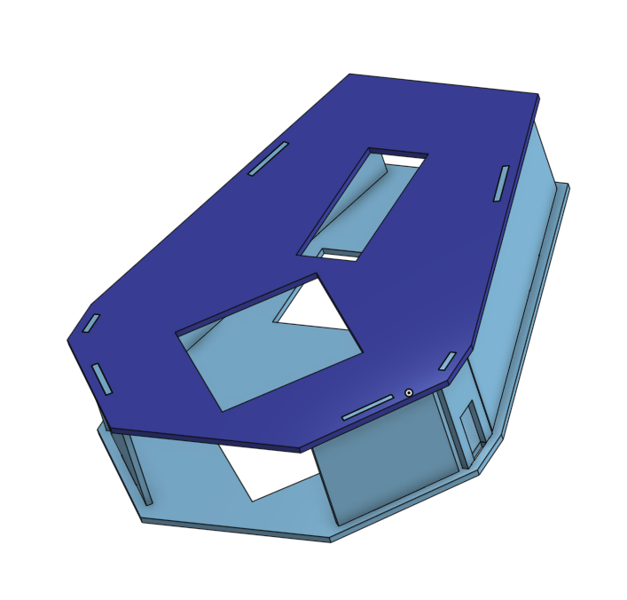
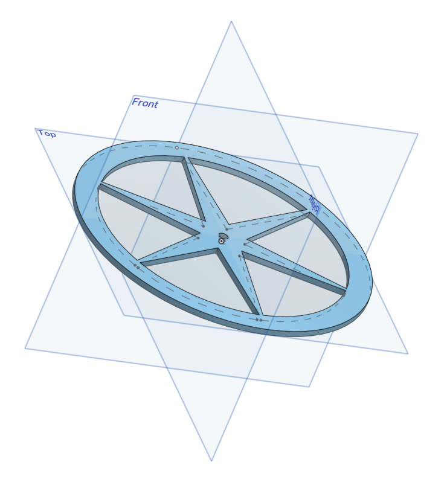
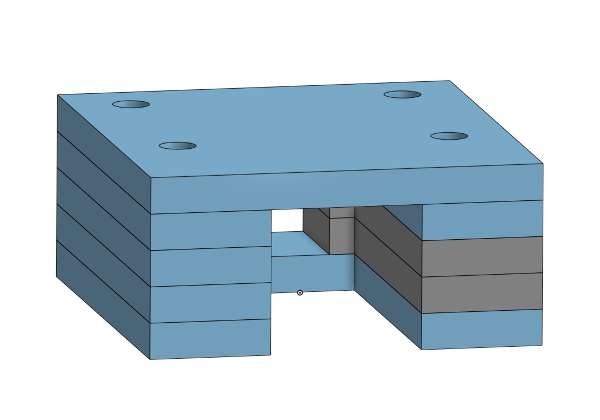

## Overview
I designed and built a small car using laser-cut components controlled with a PIC32 microcontroller using a camera for sensory feedback for line-following.

## Implementation

### Components

* 5 ft2 Clear acrylic for laser-cutting
* Assorted screws, nuts, washers, spacers
* 10x10 in PCB with PIC32MX270F256D designed for compatibility with components detailed below
* 2 rechargable LI batteries
* 1 camera
* 2 rotary motors
* 1 LCD touchscreen

### Chassis

### Wheels

### Motor Clasp

## Resources:

* Skeleton code from Nick Marchuk (Northwestern U.)
* [LCD Touchscreen datasheet](https://cdn-shop.adafruit.com/datasheets/ILI9341.pdf)
* [H-bridge reference](https://www.pololu.com/product/2135)
* [Camera reference](http://web.mit.edu/6.111/www/f2016/tools/OV7670_2006.pdf)
* [PIC reference](http://ww1.microchip.com/downloads/en/DeviceDoc/PIC32MX1XX2XX-28-36-44-PIN-DS60001168K.pdf)

## Author

* **Mark Dyehouse** -[ThePenultimatum](https://github.com/ThePenultimatum)

## Acknowledgments

* Nick Marchuk (Northwestern U.)
